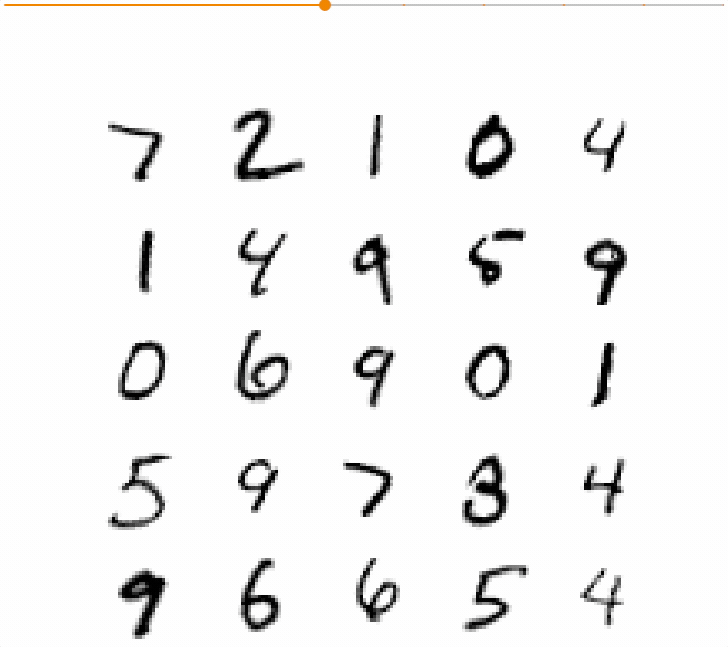

# Spatial-Transformer-Networks-with-Keras
This repository provides a Colab Notebook that shows how to use [Spatial Transformer Networks (STN)](https://arxiv.org/abs/1506.02025) inside CNNs build in Keras. I have used utility functions mostly from [this repository](https://github.com/kevinzakka/spatial-transformer-network) to demonstrate an end-to-end example. STNs allow a (vision) network to learn the optimal spatial transformations for maximizing its performance. In other words, we can expect when STNs are incorporated inside a network, it would learn how much to rotate or crop (or any affine transformations) the given input images so as to make itself more invariant to these changes.

Here's a demonstration:

